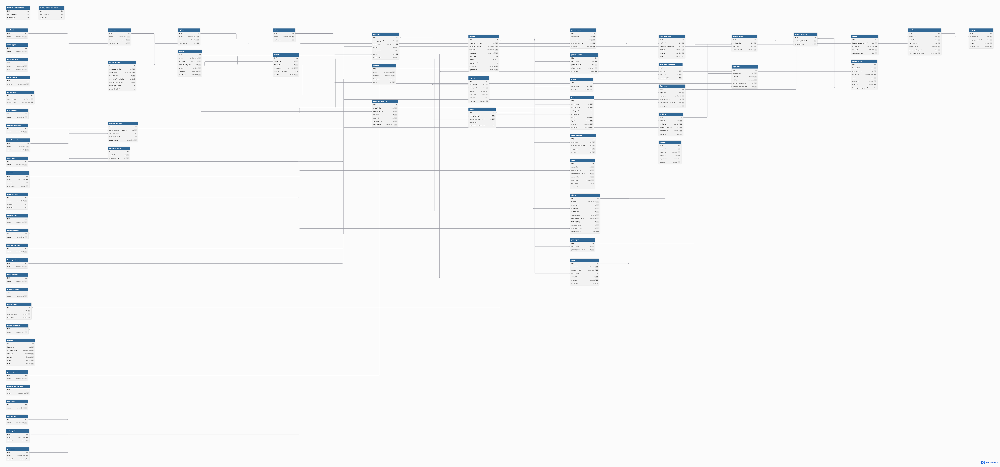

# Sistema de Gestión de Tiquetes Aéreos
#### Wendy Angélica vega Sánchez  |  Sahiam Valentina Esteban Esteban  |  Felipe corredor silva


> Aplicación de consola en C# para gestionar el ciclo operativo completo de venta y administración de tiquetes aéreos: aerolíneas, aeropuertos, vuelos, clientes, reservas, pasajeros, tiquetes, pagos y reportes.

---

## 📋 Tabla de contenido

- [Descripción del proyecto](#descripción-del-proyecto)
- [Tecnologías utilizadas](#tecnologías-utilizadas)
- [Arquitectura](#arquitectura)
- [Estructura del proyecto](#estructura-del-proyecto)
- [Base de datos](#base-de-datos)
- [Requisitos previos](#requisitos-previos)
- [Instalación y configuración](#instalación-y-configuración)
- [Migraciones](#migraciones)
- [Ejecución](#ejecución)
- [Módulos del sistema](#módulos-del-sistema)
- [Consultas LINQ implementadas](#consultas-linq-implementadas)
- [Flujo de uso](#flujo-de-uso)
- [Usuarios por defecto](#usuarios-por-defecto)
- [Equipo de desarrollo](#equipo-de-desarrollo)
- [Prompts de IA utilizados](#prompts-de-ia-utilizados)

---

## Descripción del proyecto

El **Sistema de Gestión de Tiquetes Aéreos** es una aplicación de consola desarrollada en C# como proyecto académico. El objetivo es gestionar el ciclo completo de la operación aérea: desde el registro de aerolíneas y vuelos hasta la emisión de tiquetes y generación de reportes operativos.

El sistema protege reglas críticas de negocio como evitar sobreventa de asientos, controlar transiciones de estado de reservas y vuelos, asegurar que los tiquetes solo se emitan con reserva confirmada y pago aprobado, y mantener consistencia transaccional entre todas las operaciones.

La interacción es completamente por consola usando menús interactivos con **Spectre.Console**. No incluye interfaz web, móvil ni integración con pasarelas de pago reales.

---

## Tecnologías utilizadas

| Tecnología | Versión | Uso |
|---|---|---|
| C# / .NET | .NET 10 | Lenguaje y plataforma principal |
| Entity Framework Core | 9.x | ORM para acceso a datos y LINQ |
| MySQL | 8.0+ | Base de datos relacional |
| Pomelo.EntityFrameworkCore.MySql | 9.x | Conector EF Core para MySQL |
| MySqlConnector | — | Detección de versión de servidor |
| Spectre.Console | — | UI de consola: tablas, menús, colores |
| BCrypt.Net-Next | — | Hash seguro de contraseñas |
| Microsoft.Extensions.DependencyInjection | — | Inyección de dependencias |
| Microsoft.Extensions.Configuration | — | Configuración desde appsettings.json |

---

## Arquitectura

El proyecto implementa una arquitectura **hexagonal (Ports & Adapters)** combinada con principios de **Clean Architecture**, organizada de forma **modular por tabla** — 63 módulos, uno por cada tabla de la base de datos.

La arquitectura hexagonal define al dominio como el núcleo del sistema, completamente aislado de detalles externos. Las capas externas (consola, base de datos, EF Core) se conectan al núcleo a través de puertos (interfaces) y adaptadores (implementaciones concretas).
```
┌─────────────────────────────────────────────────┐
│                  INFRAESTRUCTURA                │
│   MySQL · EF Core · Repositories · Seeders      │
│  ┌───────────────────────────────────────────┐  │
│  │              APPLICATION                  │  │
│  │      Services · UseCases · IUnitOfWork    │  │
│  │  ┌─────────────────────────────────────┐  │  │
│  │  │              DOMAIN                 │  │  │
│  │  │  Aggregates · ValueObjects · Ports  │  │  │
│  │  └─────────────────────────────────────┘  │  │
│  └───────────────────────────────────────────┘  │
└─────────────────────────────────────────────────┘

```
**Puertos (interfaces definidas en Domain/Application):**
- `InombreModuloRepository` → contrato de persistencia por módulo
- `IUnitOfWork` → contrato de transaccionalidad
- `InombreModuloService` → contrato de aplicación consumido por la UI

**Adaptadores:**
- `nombreModuloRepository` (Infrastructure) → implementa los puertos de persistencia con EF Core
- `nombreModuloMenu` (UI) → adaptador de entrada que consume los servicios de aplicación
- `AppDbContext` → adaptador de salida hacia MySQL

**Principios aplicados:**
- El **dominio no depende** de EF Core, MySQL ni de la consola
- Los **repositorios nunca llaman** `SaveChangesAsync` — esa responsabilidad es del `UseCase` a través del puerto `IUnitOfWork`
- La **consola no contiene** lógica de negocio ni consultas LINQ directas
- Las **reglas de negocio** (transiciones de estado, validaciones de disponibilidad) viven exclusivamente en el dominio y los use cases

---

## Estructura del proyecto

```
GestorDeVuelosProyectoFinal/
├── src/
│   ├── Auth/
│   │   ├── Application/
│   │   │   └── AuthService.cs
│   │   └── UI/
│   │       ├── AuthEntryMenu.cs
│   │       └── AdminNavigationMenu.cs
│   │
│   ├── Moduls/                          ← 63 módulos (uno por tabla)
│   │   └── NombreModulo/
│   │       ├── Domain/
│   │       │   ├── Aggregate/
│   │       │   │   └── NombreModulo.cs
│   │       │   ├── ValueObject/
│   │       │   │   ├── NombreModuloId.cs
│   │       │   │   └── (un Value Object por campo)
│   │       │   └── Repositories/
│   │       │       └── INombreModuloRepository.cs
│   │       ├── Infrastructure/
│   │       │   └── ├──Persistence/
│   │       │       │   ├── Seeders/
│   │       │       │   │   └── NombreModuloSeeder.cs
│   │       │       ├── Entities/
│   │       │       │   ├── NombreModuloEntity.cs
│   │       │       │   └── NombreModuloEntityConfiguration.cs
│   │       │       ├── Repositories/
│   │       │       │   └── NombreModuloRepository.cs
│   │       ├── Application/
│   │       │   ├── Interfaces/
│   │       │   │   └── INombreModuloService.cs
│   │       │   ├── Services/
│   │       │   │   └── NombreModuloService.cs
│   │       │   └── UseCases/
│   │       │       ├── GetNombreModuloUseCase.cs
│   │       │       ├── CreateNombreModuloUseCase.cs
│   │       │       ├── UpdateNombreModuloUseCase.cs
│   │       │       └── DeleteNombreModuloUseCase.cs
│   │       └── UI/
│   │           └── NombreModuloMenu.cs
│   │
│   └── Shared/
│       ├── Context/
│       │   ├── AppDbContext.cs
│       │   ├── AppDbContextDesignTimeFactory.cs
│       │   └── UnitOfWork.cs
│       ├── Contracts/
│       │   └── IUnitOfWork.cs
│       ├── Helpers/
│       │   ├── DbContextFactory.cs
│       │   └── MySqlVersionResolver.cs
│       ├── Session/
│       │   └── UserSession.cs
│       └── UI/
│           ├── IModuleUI.cs
│           └── LoginConsoleUI.cs
│           └── ConsoleWelcome.cs
|           └── ConsoleMenuHelpers.cs
│
├── Composition/
│   ├── GestorServiceRegistration.cs     ← registro de DI de todos los módulos
│   └── MySqlConnectionOptions.cs
│
|── assets/
│   └── images/
│       └── diagramaER.png
├── appsettings.json
├── db.sql                               ← DDL completo (63 tablas) 
├── Program.cs
└── README.md
```

---

## Base de datos

La base de datos contiene **63 tablas** organizadas en los siguientes grupos:

| Grupo | Tablas |
|---|---|
| Geografía | continents, countries, regions, cities |
| Direcciones | street_types, addresses |
| Personas | document_types, persons, email_domains, phone_codes, person_emails, person_phones |
| Clientes | clients |
| Aerolíneas y aeropuertos | airlines, airports, airport_airline |
| Personal | staff_positions, staff, availability_statuses, staff_availability |
| Aeronaves | aircraft_manufacturers, aircraft_models, aircraft, cabin_types, cabin_configurations |
| Rutas y tarifas | routes, route_stopovers, seasons, passenger_types, fares |
| Vuelos | flight_statuses, flight_status_transitions, flights, flight_crew_roles, flight_crew_assignments |
| Asientos | seat_location_types, flight_seats |
| Pasajeros | passengers |
| Reservas | booking_statuses, booking_status_transitions, bookings, booking_flights, booking_passengers |
| Tiquetes | ticket_statuses, tickets |
| Check-in y equipaje | checkin_statuses, check_ins, baggage_types, baggage |
| Facturación | invoice_item_types, invoices, invoice_items |
| Pagos | payment_statuses, payment_method_types, card_types, card_issuers, payment_methods, payments |
| Autenticación | system_roles, permissions, role_permissions, users, sessions |

El script DDL completo está en [`db.sql`](./db.sql).

---

## Diagrama entidad-relación
https://dbdiagram.io/d/69e91ca01bbca03312177755




## Requisitos previos

Antes de ejecutar el proyecto necesitas tener instalado:

- [.NET 10 SDK](https://dotnet.microsoft.com/download)
- [MySQL 8.0 o superior](https://dev.mysql.com/downloads/)
- [Git](https://git-scm.com/)

Verifica las versiones instaladas:

```bash
dotnet --version
mysql --version
git --version
```

---

## Instalación y configuración

**1. Clona el repositorio**

```bash
git clone https://github.com/wen-27/GestorDeVuelosProyectoFinal-1.git
cd GestorDeVuelosProyectoFinal-1
```

**2. Crea la base de datos en MySQL**

Conéctate a MySQL y ejecuta:

```sql
CREATE DATABASE airline_ticket_system
    CHARACTER SET utf8mb4
    COLLATE utf8mb4_unicode_ci;
```

> No es necesario ejecutar el `db.sql` manualmente. Las migraciones de EF Core crean todas las tablas automáticamente.

**3. Configura la cadena de conexión**

Edita el archivo `appsettings.json` con tus credenciales de MySQL:

```json
{
  "ConnectionStrings": {
    "MySqlDB": "Server=localhost;Port=3306;Database=airline_ticket_system;User=root;Password=TU_CONTRASEÑA;"
  }
}
```

También puedes usar la variable de entorno `MYSQL_CONNECTION` para sobreescribir la cadena sin tocar el archivo:

```bash
# Windows PowerShell
$env:MYSQL_CONNECTION="Server=localhost;Port=3306;Database=airline_ticket_system;User=root;Password=TU_CONTRASEÑA;"

# Linux / macOS
export MYSQL_CONNECTION="Server=localhost;Port=3306;Database=airline_ticket_system;User=root;Password=TU_CONTRASEÑA;"
```

**4. Restaura los paquetes NuGet**

```bash
dotnet restore
```

---

## Migraciones

Las migraciones se ejecutan con Entity Framework Core CLI. Asegúrate de tener la herramienta instalada:

```bash
dotnet tool install --global dotnet-ef
```

**Aplicar las migraciones (crea todas las tablas):**

```bash
dotnet ef database update --context AppDbContext --project GestorDeVuelosProyectoFinal.csproj --startup-project GestorDeVuelosProyectoFinal.csproj
```

**Si necesitas crear una migración nueva:**

```bash
dotnet ef migrations add NombreDeLaMigracion --context AppDbContext --project GestorDeVuelosProyectoFinal.csproj --startup-project GestorDeVuelosProyectoFinal.csproj
```

**Ver el estado de las migraciones:**

```bash
dotnet ef migrations list --context AppDbContext
```

> Las migraciones ya están generadas en el repositorio. Solo necesitas ejecutar `database update`.

---

## Ejecución

### Opción 1 — Comando único (recomendado)

```bash
dotnet run --project GestorDeVuelosProyectoFinal.csproj
```

Este comando es suficiente porque `Program.cs` aplica las migraciones pendientes automáticamente antes de iniciar la aplicación. No necesitas correr `dotnet ef database update` por separado.

### Opción 2 — Scripts de arranque

Si el repositorio incluye los scripts de conveniencia:

**Linux / macOS:**
```bash
./run-app.sh
```

**Windows:**
```cmd
run-app.cmd
```

### En otro equipo

Para ejecutar el proyecto en una máquina diferente solo necesitas:

1. Tener MySQL 8.0 encendido y accesible
2. Cambiar la cadena de conexión en `appsettings.json` con las credenciales locales
3. Correr cualquiera de los comandos anteriores

> Las migraciones se aplican solas al arrancar. No se necesita ningún paso manual adicional.
> El proyecto compila correctamente. Las advertencias de NuGet por acceso de red son informativas y no bloquean el arranque.

---

## Módulos del sistema

### Panel de administrador

| Sección | Módulos incluidos |
|---|---|
| Geografía | Continentes, Países, Regiones, Ciudades |
| Direcciones | Tipos de vía, Direcciones |
| Personas y contacto | Tipos de documento, Personas, Dominios de email, Emails, Códigos de teléfono, Teléfonos |
| Aerolíneas y aeropuertos | Aerolíneas, Aeropuertos, Relación aeropuerto-aerolínea |
| Personal y empleados | Cargos, Empleados, Disponibilidad, Roles de vuelo, Asignación de tripulación |
| Aeronaves y cabinas | Fabricantes, Modelos, Aeronaves, Tipos de cabina, Configuraciones de cabina |
| Rutas y tarifas | Rutas, Escalas, Temporadas, Tipos de pasajero, Tarifas |
| Vuelos | Estados de vuelo, Transiciones de estado, Vuelos, Tipos de asiento, Asientos |
| Operaciones | Pasajeros, Estados de reserva, Reservas, Vuelos de reserva, Pasajeros de reserva |
| Tiquetes | Estados de tiquete, Tiquetes |
| Check-in y equipaje | Estados de check-in, Check-ins, Tipos de equipaje, Equipaje |
| Facturación | Tipos de ítem, Facturas, Ítems de factura |
| Pagos | Estados de pago, Métodos de pago, Tipos de tarjeta, Emisores, Pagos |
| Usuarios y sesiones | Roles del sistema, Permisos, Usuarios, Sesiones |
| Reportes LINQ | 8 consultas de análisis operativo |

### Portal del cliente

| Sección | Funcionalidad |
|---|---|
| Buscar vuelos | Búsqueda por origen, destino, fecha y clase |
| Reservar vuelo | Compra con datos de pasajeros y pago simulado |
| Mis reservas | Historial y cancelación de reservas propias |
| Mis tiquetes | Consulta de tiquetes emitidos |
| Hacer check-in | Check-in en línea con selección de asiento |
| Mis facturas y pagos | Historial de facturación y pagos |
| Mi perfil | Datos personales del usuario |

---

## Consultas LINQ implementadas

El módulo de reportes implementa **8 consultas LINQ** sobre datos reales de la base de datos,
usando joins manuales (sin navegación) para máxima compatibilidad:

| # | Reporte | Operaciones LINQ |
|---|---|---|
| 1 | Vuelos con mayor ocupación | `join`, `let`, `OrderByDescending` |
| 2 | Vuelos con asientos disponibles | `join`, `where`, `OrderBy` |
| 3 | Top 5 clientes con más reservas | `join`, `GroupBy`, `Sum`, `OrderByDescending`, `Take` |
| 4 | Top 5 destinos más solicitados | `join`, `GroupBy`, `Count`, `OrderByDescending`, `Take` |
| 5 | Reservas por estado | `join`, `GroupBy`, `Sum`, `OrderByDescending` |
| 6 | Ingresos estimados por aerolínea | `join`, `GroupBy`, `Sum`, `Distinct`, `OrderByDescending` |
| 7 | Tiquetes emitidos por rango de fechas | `join`, `where` con rango, `OrderByDescending` |
| 8 | Usuarios registrados en el sistema | `join`, `GroupBy`, `Count`, `OrderBy` |

Ejemplo de consulta implementada (destinos más solicitados):

```csharp
var result =
    from bf in bookingFlights
    join f  in flights  on bf.FlightId            equals f.Id
    join r  in routes   on f.RouteId              equals r.Id
    join ad in airports on r.DestinationAirportId equals ad.Id
    group bf by new { ad.Id, ad.Name, ad.IataCode } into g
    select new TopDestinationDto(
        g.Key.Name,
        g.Key.IataCode,
        g.Count());
```

---

## Flujo de uso

### Flujo de compra de tiquete (cliente)

```
1. Registrarse o iniciar sesión como cliente
2. Buscar vuelo → seleccionar origen, destino, fecha, clase
3. Ver resultados → seleccionar vuelo
4. Confirmar compra → ingresar datos de pasajeros y método de pago
5. Sistema crea: booking → booking_flights → passengers →
                 booking_passengers → payment (Paid) →
                 booking (Confirmed) → tickets (Issued)
6. Cliente recibe código de reserva y tiquetes emitidos
7. Hacer check-in (hasta 24h antes del vuelo) → seleccionar asiento
8. Sistema genera pase de abordar con código único
```

### Reglas de negocio críticas

**Emisión de tiquetes:** solo se emite cuando `booking.status = Confirmed` AND `payment.status = Paid`.

**Disponibilidad de asientos:** `available_seats` se decrementa al confirmar check-in y se incrementa al cancelar.

**Transiciones de estado de vuelo permitidas:**

```
Scheduled → Boarding → In Flight → Completed
Scheduled → Cancelled
Scheduled → Rescheduled → Scheduled
```

**Transiciones de estado de reserva permitidas:**

```
Pending → Confirmed
Pending → Cancelled
Confirmed → Cancelled
```

---

## Usuarios por defecto

Al ejecutar el sistema por primera vez, los seeders crean automáticamente un usuario administrador:

| Campo | Valor |
|---|---|
| Username | `admin` |
| Contraseña | `Admin123!` |
| Rol | Admin |

> Puedes cambiar la contraseña del administrador desde el panel de **Usuarios y Sesiones** después del primer inicio de sesión.

Los clientes pueden registrarse directamente desde la pantalla de bienvenida.

---

## Equipo de desarrollo

| Integrante | Módulos responsables |
|---|---|
| **Wendy** | Módulos 1–21: Continents, Countries, Regions, Cities, StreetTypes, Addresses, DocumentTypes, Persons, EmailDomains, PhoneCodes, PersonEmails, PersonPhones, Clients, Airlines, Airports, AirportAirline, StaffPositions, Staff, AvailabilityStatuses, StaffAvailability, AircraftManufacturers |
| **Sahiam** | Módulos 22–42: AircraftModels, Aircraft, CabinTypes, CabinConfigurations, Routes, RouteStopovers, Seasons, PassengerTypes, Fares, FlightStatuses, FlightStatusTransitions, Flights, FlightCrewRoles, FlightCrewAssignments, SeatLocationTypes, FlightSeats, Passengers, BookingStatuses, BookingStatusTransitions, Bookings, BookingFlights, |
| **Felipe** | Módulos 43-63 BookingPassengers, TicketStatuses, Tickets, CheckinStatuses, CheckIns, BaggageTypes, Baggage, InvoiceItemTypes, Invoices, InvoiceItems, PaymentStatuses, PaymentMethodTypes, CardTypes, CardIssuers, PaymentMethods, Payments, SystemRoles, Permissions, RolePermissions, Users, Sessions + módulo Reports |

---

## Prompts de IA utilizados

Durante el desarrollo se utilizaron herramientas de IA para asistir en la generación de código. A continuación se documentan los prompts principales utilizados.

---

### Prompt 1 — Implementacion portal cliente

Tengo una aplicación de consola en C# (.NET) llamada GestorDeVuelosProyectoFinal.
Usa Spectre.Console para la UI, Entity Framework Core con MySQL, arquitectura por módulos
con capas Domain/Infrastructure/Application/UI, inyección de dependencias con
Microsoft.Extensions.DependencyInjection, y BCrypt para contraseñas.

La estructura de módulos sigue este patrón exacto:
src/Moduls/NombreModulo/
  Application/Interfaces/INombreServicio.cs
  Application/Services/NombreServicio.cs
  Application/UseCases/AccionUseCase.cs
  UI/NombreMenu.cs

El registro de DI está en Composition/GestorServiceRegistration.cs usando
services.AddTransient<>. Los menús implementan la interfaz IModuleUI con
propiedades Key y Title y método RunAsync(CancellationToken).

El AppDbContext ya tiene estas entidades relevantes disponibles:
- users (Id, Username, PasswordHash, PersonId, RoleId, IsActive, LastAccess, CreatedAt, UpdatedAt)
- persons (Id, DocumentTypeId, DocumentNumber, FirstName, LastName, BirthDate, Gender, AddressId)
- clients (Id, PersonId, CreatedAt)
- flights (Id, FlightCode, AirlineId, RouteId, AircraftId, DepartureAt, EstimatedArrivalAt, TotalCapacity, AvailableSeats, FlightStatusId)
- routes (Id, OriginAirportId, DestinationAirportId, DistanceKm, EstimatedDurationMin)
- airports (Id, Name, IataCode, IcaoCode, CityId)
- cities (Id, Name, RegionId)
- regions (Id, Name, Type, CountryId)
- bookings (Id, ClientId, BookedAt, BookingStatusId, TotalAmount, ExpiresAt)
- booking_flights (Id, BookingId, FlightId, PartialAmount)
- booking_passengers (Id, BookingFlightId, PassengerId)
- passengers (Id, PersonId, PassengerTypeId)
- tickets (Id, Code, IssueDate, PassengerReservation_Id, TicketState_Id)
- payments (Id, BookingId, Amount, PaidAt, PaymentStatusId, PaymentMethodId)
- sessions (Id, UserId, StartedAt, EndedAt, IpAddress, IsActive)
- system_roles (Id, Name)
- flight_seats (Id, FlightId, SeatCode, CabinTypeId, SeatLocationTypeId, IsOccupied)
- passenger_reservations (Id, Flight_Reservation_Id, Passenger_Id)

La sesión activa se maneja con la clase estática UserSession que ya existe:
UserSession.Current (tiene UserId, RoleId, RoleName, IsAdmin)
UserSession.Login(userId, roleId, roleName)
UserSession.Logout()

La autenticación ya existe en Auth/Application/IAuthService.cs y Auth/ui/AuthEntryMenu.cs.
El login ya funciona con BCrypt verificando el hash.

Necesito que implementes el PORTAL DEL CLIENTE completo. El cliente es un usuario con
role = "Client" que después de hacer login entra a su propio portal. El portal debe
tener las siguientes secciones en el menú principal del cliente:

=== PORTAL DEL CLIENTE ===
1. Buscar y comprar vuelos
2. Mis reservas
3. Hacer check-in en línea
4. Mis tiquetes
5. Cerrar sesión

--- SECCIÓN 1: BUSCAR Y COMPRAR VUELOS ---

Pantalla de búsqueda pide:
- Tipo de viaje: [Ida y vuelta] [Solo ida]
- Ciudad origen (busca en cities, muestra región y país)
- Ciudad destino (busca en cities)
- Fecha de ida (formato yyyy-MM-dd, o presionar Enter para "no definida")
- Si es ida y vuelta: fecha de regreso
- Número de pasajeros adultos (mínimo 1)
- Número de pasajeros menores (puede ser 0)
- Clase: Económica / Ejecutiva / Primera Clase

Resultados de búsqueda:
- Hace join: flights → routes → airports → cities filtrando por
  ciudad origen, ciudad destino y fecha (si fue definida)
- Si no hay vuelos: muestra mensaje "No hay vuelos disponibles.
  Te mostramos vuelos en fechas cercanas (+/- 3 días)"
  y repite la búsqueda con ese rango
- Cada resultado muestra:
  Vuelo [FlightCode] | [OriginIata] → [DestinationIata] |
  Salida: [DepartureAt] | Llegada: [EstimatedArrivalAt] |
  Duración: X h Ym | Asientos disponibles: N | Precio base

- El usuario selecciona un vuelo con flechas (SelectionPrompt de Spectre.Console)
- Si eligió "Ida y vuelta" busca también el vuelo de regreso (mismo proceso)

Pantalla de confirmación de compra muestra:
  [Origen] → [Destino] | Ida y vuelta o Solo ida | # pasajeros
  Precio total calculado | [Ver detalle] [Confirmar compra]

Ver detalle muestra:
  Vuelo de ida: FlightCode | Fecha | Hora salida | Hora llegada |
  Aeropuerto origen | Aeropuerto destino | Duración | Clase
  (Si ida y vuelta, repite para vuelo de regreso)

Confirmar compra hace:
1. Pide datos de cada pasajero:
   - Nombres | Apellidos | País residencia | Tipo documento |
     Número documento | Fecha nacimiento | Sexo (M/F)
2. Datos de contacto:
   - Email | Confirmar email | Código país | Número celular
3. Método de pago (simulado, no integración real):
   - [Tarjeta crédito] [PSE] [Nequi] [Tarjeta débito]
   - Si elige tarjeta: pide Número | Titular | Vencimiento |
     Código seguridad (solo para mostrar, no valida realmente)
4. Al confirmar:
   - Crea registro en bookings con status "Pending"
   - Crea registros en booking_flights
   - Crea registros en passengers y booking_passengers
   - Crea registro en payments con status "Paid" (simulado)
   - Cambia booking status a "Confirmed"
   - Genera tickets con código único formato TKT-YYYYMMDD-XXXX
   - Muestra mensaje: "¡Compra exitosa! Tu código de reserva es [ID]"
   - Muestra resumen con todos los tiquetes generados

--- SECCIÓN 2: MIS RESERVAS ---

Lista todas las reservas del cliente autenticado (filtrar por ClientId = UserSession.Current.UserId
mapeado al cliente correspondiente).

Muestra tabla con:
ID | Fecha reserva | Estado | # vuelos | Monto total

Al seleccionar una reserva muestra detalle:
- Información de cada vuelo de la reserva
- Lista de pasajeros
- Estado del pago
- Opción: [Cancelar reserva] (solo si status es Pending o Confirmed)

Cancelar reserva:
- Pide confirmación con AnsiConsole.Confirm
- Cambia booking_status a "Cancelled"
- Cambia tickets relacionados a estado "Voided"
- Muestra mensaje de confirmación

--- SECCIÓN 3: CHECK-IN EN LÍNEA ---

Check-in disponible solo hasta 24 horas antes del vuelo.

Pantalla inicial pide:
- Código de reserva (el ID de la reserva) o busca por apellido del pasajero

Muestra los vuelos de esa reserva que aplican para check-in:
  [FlightCode] | [Origen] → [Destino] | Fecha | Hora salida | Hora llegada | Duración

El usuario selecciona el vuelo y luego:
1. Muestra información de seguridad (solo texto):
   ARTÍCULOS PERMITIDOS EN CABINA (con restricciones):
   - Cargadores externos, baterías de litio, cigarrillos electrónicos
   ARTÍCULOS PROHIBIDOS:
   - Fuegos artificiales, líquidos inflamables, sólidos inflamables,
     gases inflamables, productos radioactivos
   [Aceptar y continuar]

2. Muestra datos del pasajero, pide contacto de emergencia:
   - Nombre contacto | Código país | Teléfono | País residencia
   [Guardar y continuar]

3. Selección de asiento:
   - Muestra grid de asientos del vuelo consultando flight_seats
   - Asientos ocupados (IsOccupied=true) se muestran como [X]
   - Asientos libres se muestran como [ ] con su código
   - El sistema asigna uno aleatorio entre los libres si el usuario
     no quiere pagar extra (muestra cuál le tocó)
   - Opción de escribir el código de asiento deseado
   [Confirmar asiento]

4. Confirmar check-in:
   - Actualiza flight_seats.IsOccupied = true para el asiento elegido
   - Actualiza ticket estado a "Used"
   - Genera número de pase de abordar formato BP-XXXXXX
   - Muestra PASE DE ABORDAR completo:
     ══════════════════════════════════════
            PASE DE ABORDAR
     ══════════════════════════════════════
     Pasajero: [Nombre completo]
     Vuelo:    [FlightCode]
     Ruta:     [OriginIata] → [DestinationIata]
     Fecha:    [DepartureAt fecha]
     Salida:   [DepartureAt hora]
     Llegada:  [EstimatedArrivalAt hora]
     Asiento:  [SeatCode]
     Clase:    [CabinType]
     Grupo:    F
     Abordaje: [DepartureAt - 60 minutos]
     Código:   [BP-XXXXXX]
     ══════════════════════════════════════

--- SECCIÓN 4: MIS TIQUETES ---

Lista todos los tiquetes del cliente autenticado.
Hace join: tickets → passenger_reservations → booking_flights → flights → routes → airports

Muestra tabla:
Código tiquete | Vuelo | Ruta | Fecha vuelo | Estado tiquete

Al seleccionar un tiquete muestra el mismo formato de pase de abordar
si el check-in ya fue realizado, o "Check-in pendiente" si no.

=== REGLAS GENERALES DE IMPLEMENTACIÓN ===

1. Todos los menús usan Spectre.Console:
   - SelectionPrompt para listas de opciones
   - TextPrompt para inputs de texto con validación
   - Table con Border.Rounded para mostrar datos
   - Rule para títulos de sección
   - AnsiConsole.Clear() al entrar a cada pantalla
   - Pause() al final de cada pantalla (presiona Enter para continuar)

2. Seguir el patrón exacto de BookingsMenu.cs para la estructura del menú

3. Manejo de errores: todos los try/catch muestran el error en
   [red]mensaje[/red] con Markup.Escape()

4. El portal del cliente se activa en AdminNavigationMenu o donde
   corresponda según el rol: si UserSession.Current.RoleName == "Client"
   muestra el portal del cliente, si es "Admin" muestra el menú de admin.

5. Registrar el portal en GestorServiceRegistration.cs con AddTransient<>

6. Crear el archivo en:
   src/Moduls/ClientPortal/UI/ClientPortalMenu.cs

7. Si necesitas crear servicios auxiliares para las consultas de búsqueda
   de vuelos, créalos en:
   src/Moduls/ClientPortal/Application/

8. Usar LINQ con joins manuales (sin .Include()) porque las entidades
   no tienen propiedades de navegación. Patrón:
   var result = from a in listaA
                join b in listaB on a.Id equals b.AId
                select new { ... };

9. Los pagos son simulados: siempre se marcan como "Paid" inmediatamente,
   no hay integración real con pasarelas.

10. Generar códigos únicos así:
    - Tiquete: $"TKT-{DateTime.UtcNow:yyyyMMdd}-{Guid.NewGuid().ToString()[..4].ToUpper()}"
    - Pase de abordar: $"BP-{Guid.NewGuid().ToString()[..6].ToUpper()}"

Genera todos los archivos necesarios con el código completo y funcional.

---

### Prompt 2 — para Login y Menú Principal

Tengo una aplicación de consola en C# (.NET) llamada GestorDeVuelosProyectoFinal.
Usa Spectre.Console para toda la UI, Entity Framework Core con MySQL, BCrypt.Net-Next
para contraseñas, y arquitectura por módulos con capas Domain/Infrastructure/Application/UI.
La inyección de dependencias está en Composition/GestorServiceRegistration.cs usando
services.AddTransient<>.

=== CONTEXTO DE AUTENTICACIÓN EXISTENTE ===

La sesión activa se maneja con esta clase estática ya existente en
src/Shared/Session/UserSession.cs:

    public class UserSession
    {
        public int UserId { get; private set; }
        public int RoleId { get; private set; }
        public string RoleName { get; private set; }
        public bool IsAdmin => RoleName == "Admin";
        public static UserSession? Current { get; private set; }
        public static void Login(int userId, int roleId, string roleName)
        public static void Logout()
    }

Las tablas relevantes en MySQL (ya con entidades y DbSets en AppDbContext) son:

    users:        Id, Username, PasswordHash, PersonId(nullable), RoleId, IsActive,
                  LastAccess(nullable), CreatedAt, UpdatedAt
    persons:      Id, DocumentTypeId, FirstName, LastName, DocumentNumber,
                  BirthDate(nullable), Gender(nullable), AddressId(nullable)
    clients:      Id, PersonId, CreatedAt
    system_roles: Id, Name, Description
    sessions:     Id, UserId, StartedAt, EndedAt(nullable), IpAddress(nullable), IsActive
    document_types: Id, Name, Code  (CC, PASSPORT, DNI, TI...)

Los DbSets en AppDbContext se llaman exactamente:
    _context.Users, _context.Persons, _context.Clients,
    _context.SystemRoles, _context.Sessions, _context.DocumentTypes

Los roles existentes en la BD son exactamente dos: "Admin" y "Client".

Ya existen estos servicios registrados en DI que puedes inyectar:
    IUsersService      → GetByUsernameAsync(username), GetByIdAsync(id), UpdateAsync(...)
    ISessionsService   → CreateAsync(...), GetActiveSessionsByUserIdAsync(userId),
                         CloseSessionAsync(sessionId)
    ISystemRolesService → GetByIdAsync(id), GetByNameAsync(name)

=== LO QUE DEBES IMPLEMENTAR ===

--- ARCHIVO 1: src/Shared/UI/ConsoleWelcome.cs ---

Pantalla de bienvenida que es el PUNTO DE ENTRADA de toda la aplicación.
Es lo primero que ve el usuario al ejecutar el programa.

Debe mostrar con Spectre.Console:

    ┌─────────────────────────────────────────────┐
    │   FigletText "Gestor de Vuelos"  Color.Blue  │
    │   FigletText "Aéreos"  Color.Cyan1           │
    │                                              │
    │   [bold]Bienvenido al Sistema de Gestión     │
    │         de Tiquetes Aéreos[/bold]            │
    │                                              │
    │   ¿Qué deseas hacer?                         │
    │   > Iniciar sesión                           │
    │     Registrarse                              │
    │     Salir                                    │
    └─────────────────────────────────────────────┘

Usar SelectionPrompt con HighlightStyle Color.DeepSkyBlue1.

Si elige "Salir": muestra mensaje de despedida y termina la aplicación
con Environment.Exit(0).

Si elige "Iniciar sesión": llama a LoginFlow (ver abajo).
Si elige "Registrarse": llama a RegisterFlow (ver abajo).

Después de login o registro exitoso, según el rol del usuario autenticado:

- Si RoleName == "Admin"  → llama a AdminNavigationMenu.RunAsync()
- Si RoleName == "Client" → llama a ClientPortalMenu.RunAsync()
  (ambos ya existen y están registrados en DI, inyéctalos en el constructor)

--- LOGIN FLOW ---

Máximo 3 intentos. En cada intento:

1. Pide Username con TextPrompt (no puede estar vacío)
2. Pide contraseña con TextPrompt.Secret() (no puede estar vacía)
3. Busca el usuario con IUsersService.GetByUsernameAsync(username)
4. Si no existe: muestra [red]Usuario o contraseña incorrectos[/red]
5. Si existe pero IsActive == false:
   muestra [red]Tu cuenta está desactivada. Contacta al administrador.[/red]
6. Verifica contraseña con BCrypt.Net.BCrypt.Verify(password, user.PasswordHash)
7. Si la contraseña no coincide: muestra [red]Usuario o contraseña incorrectos[/red]
8. Si todo es correcto:
   a. Obtiene el rol con ISystemRolesService.GetByIdAsync(user.RoleId)
   b. Registra sesión con ISessionsService.CreateAsync pasando userId e IP local
   c. Llama UserSession.Login(user.Id, user.RoleId, roleName)
   d. Muestra [green]Bienvenido [bold]username[/bold] — Rol: roleName[/green]
   e. Retorna true

Si agota los 3 intentos: muestra mensaje de error y vuelve al ConsoleWelcome
(no cierra la aplicación, solo regresa al menú de bienvenida).

Para obtener IP local usar:
    System.Net.Dns.GetHostEntry(System.Net.Dns.GetHostName())
        .AddressList.FirstOrDefault(x =>
            x.AddressFamily == System.Net.Sockets.AddressFamily.InterNetwork)
        ?.ToString()

--- REGISTER FLOW ---

Registro de nuevo usuario con rol "Client" (los Admin solo los crea otro Admin
desde el panel de administración, no desde aquí).

Paso 1 — Datos personales:
    Mostrar título: [bold deepskyblue1]Registro de nuevo usuario[/bold deepskyblue1]
    - Nombres (TextPrompt, no vacío, mínimo 2 caracteres)
    - Apellidos (TextPrompt, no vacío, mínimo 2 caracteres)
    - Tipo de documento: SelectionPrompt cargando opciones desde
      _context.DocumentTypes.ToListAsync() mostrando el Name de cada uno
    - Número de documento (TextPrompt, no vacío)
    - Fecha de nacimiento (TextPrompt formato yyyy-MM-dd, validar que sea fecha válida
      y que la persona tenga al menos 5 años)
    - Sexo: SelectionPrompt con opciones ["Masculino (M)", "Femenino (F)", "No especificar (N)"]
      guardar solo el char: M, F o N

Paso 2 — Datos de acceso:
    - Username (TextPrompt, no vacío, sin espacios, mínimo 4 caracteres)
      Validar que no exista ya en la BD con IUsersService.GetByUsernameAsync
      Si ya existe mostrar error y pedir de nuevo
    - Contraseña (TextPrompt.Secret, mínimo 6 caracteres)
    - Confirmar contraseña (TextPrompt.Secret, debe coincidir con la anterior)

Al confirmar el registro:

1. Crear registro en persons:
   PersonEntity { FirstName, LastName, DocumentTypeId, DocumentNumber,
                  BirthDate, Gender, CreatedAt = UtcNow, UpdatedAt = UtcNow }
   Guardar con _context.Persons.AddAsync() y _context.SaveChangesAsync()

2. Crear registro en clients:
   ClientEntity { PersonId = person.Id, CreatedAt = UtcNow }
   Guardar con _context.Clients.AddAsync() y _context.SaveChangesAsync()

3. Obtener el RoleId de "Client" con:
   _context.SystemRoles.FirstOrDefaultAsync(r => r.Name == "Client")

4. Crear registro en users:
   UserEntity { Username, PasswordHash = BCrypt.Net.BCrypt.HashPassword(password),
                PersonId = person.Id, RoleId = clientRole.Id,
                IsActive = true, CreatedAt = UtcNow, UpdatedAt = UtcNow }
   Guardar con _context.Users.AddAsync() y _context.SaveChangesAsync()

5. Mostrar:
   [green]✓ Registro exitoso. Ya puedes iniciar sesión.[/green]
   Pausa con "Presiona Enter para continuar..."
   Volver al ConsoleWelcome

Si ocurre cualquier excepción: mostrar [red]Error: {mensaje}[/red] con Markup.Escape()
y volver al ConsoleWelcome.

--- ARCHIVO 2: Actualizar Program.cs ---

El Program.cs debe quedar así después de inicializar los seeders:

    var ConsoleWelcome = scope.ServiceProvider.GetRequiredService<ConsoleWelcome>();
    await ConsoleWelcome.RunAsync();

Eliminar cualquier llamada directa a AuthEntryMenu desde Program.cs
ya que ConsoleWelcome ahora es el punto de entrada.

--- ARCHIVO 3: Actualizar GestorServiceRegistration.cs ---

Agregar al final de los AddTransient de menús:

    services.AddTransient<ConsoleWelcome>();

=== REGLAS GENERALES DE IMPLEMENTACIÓN ===

1. Todos los inputs usan Spectre.Console — nunca Console.ReadLine() directamente
2. AnsiConsole.Clear() al inicio de cada pantalla nueva
3. Errores siempre en [red]{Markup.Escape(mensaje)}[/red]
4. Éxitos siempre en [green]mensaje[/green]
5. Títulos de sección con new Rule("[bold deepskyblue1]Título[/]").LeftJustified()
6. Pausa siempre con:
   AnsiConsole.Prompt(new TextPrompt<string>("[grey]Presiona Enter para continuar...[/]")
       .AllowEmpty())
7. Todo el acceso a BD es async/await con CancellationToken ct = default
8. Usar using para los DbContext o inyectarlos por constructor
9. El ConsoleWelcome tiene un while(true) externo que mantiene vivo el menú
   de bienvenida hasta que el usuario elige "Salir" — después de logout
   vuelve automáticamente a mostrar el ConsoleWelcome

Genera los archivos completos y funcionales.

### Prompt 3 — Corrección de validación de credenciales (login no autentica)

Tengo una aplicación de consola C# (.NET) llamada GestorDeVuelosProyectoFinal.
El login no está autenticando correctamente — el usuario ingresa credenciales válidas
y el sistema no lo deja pasar o muestra error incorrecto.

Stack: Spectre.Console, EF Core, MySQL 8, BCrypt.Net-Next, DI con
Microsoft.Extensions.DependencyInjection.

Las contraseñas se guardan con BCrypt.Net.BCrypt.HashPassword(password) y se
verifican con BCrypt.Net.BCrypt.Verify(plainText, hash).

La sesión activa se guarda en la clase estática UserSession:
    UserSession.Login(userId, roleId, roleName)
    UserSession.Current → tiene UserId, RoleId, RoleName, IsAdmin

=== ARCHIVOS DEL LOGIN A REVISAR ===

ConsoleWelcome.cs

using Spectre.Console;

namespace GestorDeVuelosProyectoFinal.src.Shared.ui;

/// <summary>Pantalla inicial de bienvenida antes del menú de acceso.</summary>

public static class ConsoleWelcome

{

  public static void ShowSplash()

  {

​    AnsiConsole.Clear();

​    AnsiConsole.Write(

​      new FigletText("VUELOS")

​        .Color(Color.DeepSkyBlue1));

​    AnsiConsole.WriteLine();

​    AnsiConsole.Write(

​      new Panel(

​          new Rows(

​            new Markup("[bold white]Bienvenido al Gestor de Vuelos[/]"),

​            new Markup("[grey]Administración de rutas, reservas, tripulación y operaciones aéreas.[/]"),

​            new Markup(" "),

​            new Markup("[dim]Proyecto académico · consola interactiva[/]")))

​        .Header("[bold aqua]✈  Bienvenida[/]")

​        .Border(BoxBorder.Double)

​        .BorderColor(Color.Cyan1)

​        .Padding(1, 2));

​    AnsiConsole.WriteLine();

​    AnsiConsole.MarkupLine("[dim]Pulsa [bold]Enter[/] para ir al inicio de sesión…[/]");

​    AnsiConsole.Prompt(new TextPrompt<string>("").AllowEmpty());

  }

}

--------------------

IAuthService

namespace GestorDeVuelosProyectoFinal.Auth.Application;

public interface IAuthService

{

  Task EnsureSeededAsync(CancellationToken cancellationToken = default);

  Task<bool> TryLoginAsync(string username, string password, CancellationToken cancellationToken = default);

  Task RegisterUserAsync(string username, string password, CancellationToken cancellationToken = default);

}

-------------

using GestorDeVuelosProyectoFinal.Auth.Infrastructure;

using GestorDeVuelosProyectoFinal.Auth.Infrastructure.Persistence;

using Microsoft.EntityFrameworkCore;

using Microsoft.Extensions.Configuration;

namespace GestorDeVuelosProyectoFinal.Auth.Application;

public sealed class AuthService : IAuthService

{

  private const string DefaultAdminUsername = "admin";

  private const string DefaultUserUsername = "usuario";

  private const string DefaultAdminPassword = "Admin123!";

  private const string DefaultUserPassword = "User123!";

  private readonly AuthDbContext _db;

  private readonly IConfiguration _configuration;

  public AuthService(AuthDbContext db, IConfiguration configuration)

  {

​    _db = db;

​    _configuration = configuration;

  }

  public async Task EnsureSeededAsync(CancellationToken cancellationToken = default)

  {

​    var adminUser = _configuration["Auth:DefaultAdmin:Username"] ?? DefaultAdminUsername;

​    var adminPass = _configuration["Auth:DefaultAdmin:Password"] ?? DefaultAdminPassword;

​    var demoUser = _configuration["Auth:DefaultUser:Username"] ?? DefaultUserUsername;

​    var demoPass = _configuration["Auth:DefaultUser:Password"] ?? DefaultUserPassword;

​    await EnsureUserAsync(adminUser, adminPass, "Admin", cancellationToken);

​    await EnsureUserAsync(demoUser, demoPass, "User", cancellationToken);

  }

  private async Task EnsureUserAsync(string username, string plainPassword, string role, CancellationToken cancellationToken)

  {

​    var exists = await _db.AppUsers.AsNoTracking().AnyAsync(u => u.Username == username, cancellationToken);

​    if (exists)

​      return;

​    _db.AppUsers.Add(new AppUserEntity

​    {

​      Username = username,

​      PasswordHash = BCrypt.Net.BCrypt.HashPassword(plainPassword),

​      Role = role,

​      CreatedAt = DateTime.UtcNow

​    });

​    await _db.SaveChangesAsync(cancellationToken);

  }

  public async Task<bool> TryLoginAsync(string username, string password, CancellationToken cancellationToken = default)

  {

​    var user = await _db.AppUsers.FirstOrDefaultAsync(u => u.Username == username, cancellationToken);

​    if (user is null)

​      return false;

​    if (!BCrypt.Net.BCrypt.Verify(password, user.PasswordHash))

​      return false;

​    ApplicationSession.UserId = user.Id;

​    ApplicationSession.Username = user.Username;

​    ApplicationSession.Role = user.Role;

​    return true;

  }

  public async Task RegisterUserAsync(string username, string password, CancellationToken cancellationToken = default)

  {

​    if (await _db.AppUsers.AnyAsync(u => u.Username == username, cancellationToken))

​      throw new InvalidOperationException($"El usuario '{username}' ya existe.");

​    _db.AppUsers.Add(new AppUserEntity

​    {

​      Username = username,

​      PasswordHash = BCrypt.Net.BCrypt.HashPassword(password),

​      Role = "User",

​      CreatedAt = DateTime.UtcNow

​    });

​    await _db.SaveChangesAsync(cancellationToken);

  }

-----------------

namespace GestorDeVuelosProyectoFinal.Auth.Infrastructure.Persistence;

public sealed class AppUserEntity

{

  public int Id { get; set; }

  public string Username { get; set; } = null!;

  public string PasswordHash { get; set; } = null!;

  /// <summary>Admin o User</summary>

  public string Role { get; set; } = null!;

  public DateTime CreatedAt { get; set; }

}


---------------------------------

namespace GestorDeVuelosProyectoFinal.Auth.Application;

public static class ApplicationSession

{

  public static int? UserId { get; set; }

  public static string? Username { get; set; }

  public static string? Role { get; set; }

  public static bool IsAuthenticated => UserId.HasValue && !string.IsNullOrWhiteSpace(Role);

  public static void Clear()

  {

​    UserId = null;

​    Username = null;

​    Role = null;

  }

}

----------------------

=== POSIBLES CAUSAS A INVESTIGAR ===

Revisa y corrige todos estos puntos:

1. Comparación de username: ¿usa StringComparison.OrdinalIgnoreCase o compara
   con == directo? En MySQL la comparación puede ser case-insensitive pero en
   LINQ to Objects no. Debe usar .ToLower() o StringComparison.OrdinalIgnoreCase.

2. BCrypt.Verify: ¿el primer parámetro es el texto plano y el segundo el hash?
   BCrypt.Verify(plainTextPassword, storedHash) — orden importa.

3. ¿El usuario que se está probando existe realmente en la BD con IsActive = 1?
   Verifica que el seeder haya insertado el usuario admin correctamente.

4. ¿El PasswordHash en BD es un hash BCrypt válido que empieza con $2a$ o $2b$?
   Si el seeder insertó la contraseña en texto plano, BCrypt.Verify siempre falla.

5. ¿El DbContext está siendo reutilizado entre requests o se crea uno nuevo?
   Con AddTransient debería crear instancia nueva cada vez.

6. ¿El flujo de control después del login exitoso llama correctamente
   UserSession.Login() antes de redirigir al menú?

7. ¿Hay algún try/catch que esté tragándose la excepción real sin mostrarla?

Para cada problema encontrado: muestra el código con el error y la corrección exacta.
Si necesitas ver algún archivo adicional, dímelo antes de asumir.
---

### Prompt 4 — Revisión y corrección de carpeta Application de un módulo

Tengo una aplicación de consola C# (.NET) llamada GestorDeVuelosProyectoFinal
con arquitectura modular. Cada módulo tiene una carpeta Application con:
    Application/Interfaces/INombreServicio.cs
    Application/Services/NombreServicio.cs
    Application/UseCases/GetUseCase.cs
    Application/UseCases/CreateUseCase.cs
    Application/UseCases/UpdateUseCase.cs
    Application/UseCases/DeleteUseCase.cs

Reglas del proyecto que DEBES respetar:

- Repositorios NUNCA llaman SaveChangesAsync — solo el UseCase lo hace vía IUnitOfWork
- Los servicios no tienen lógica propia, solo delegan a los use cases
- Cada use case tiene una sola responsabilidad
- Los use cases validan referencias (FKs) antes de persistir
- Namespace del módulo: GestorDeVuelosProyectoFinal.[src.]Moduls.NombreModulo.Application

=== MÓDULO A REVISAR ===

Nombre: NOMBRE DEL MÓDULO A REVISAR  --------------------------------------------------------------------------------------------------------------------------------------

- Archivos de la carpeta application del modulo

=== QUÉ NECESITO QUE HAGAS ===

1. Revisa que la interfaz InombremoduloService declare exactamente los métodos que implementa
   el servicio — sin métodos extra ni faltantes.

2. Revisa que el servicio nombremoduloService solo delegue a use cases, sin lógica propia.
   Si tiene lógica, muévela al use case correspondiente.

3. Revisa que cada use case tenga una sola responsabilidad. Si un use case hace
   más de una cosa, sepáralo.

4. Revisa que los use cases que crean o actualizan entidades validen primero
   que existan las FKs referenciadas (otros módulos). Si no lo hacen, agrégalo.

5. Revisa que todos los use cases llamen IUnitOfWork.SaveChangesAsync() al final
   de operaciones que modifican datos. Si no lo hacen, agrégalo.

6. Revisa que no haya código duplicado entre use cases — si lo hay, extráelo.

7. Verifica que los namespaces sean correctos y los usings no tengan errores.

Para cada problema encontrado: muestra el archivo afectado, la línea con el problema
y la corrección completa. Si todo está correcto en algún archivo, confirma que está bien.

---

### Prompt 5 — Resolución de errores en terminal (dotnet run)

Tengo una aplicación de consola C# (.NET) llamada GestorDeVuelosProyectoFinal.
Al correr dotnet run obtengo los siguientes errores de compilación:

(AQUÍ LA SALIDA COMPLETA DEL TERMINAL DESPUÉS DE dotnet run) ----------------------------------------------------------------------------

Stack del proyecto:

- .NET (consola)
- Entity Framework Core con MySQL (Pomelo o MySql.EntityFrameworkCore)
- Spectre.Console
- BCrypt.Net-Next
- Arquitectura modular: Domain / Infrastructure / Application / UI
- Inyección de dependencias: Microsoft.Extensions.DependencyInjection
- Namespaces del proyecto:
  SIN src: GestorDeVuelosProyectoFinal.Moduls.NombreModulo...
  CON src: GestorDeVuelosProyectoFinal.src.Moduls.NombreModulo...
  Shared:  GestorDeVuelosProyectoFinal.src.Shared...

Para cada error en la lista:

1. Cita el error exacto (archivo, línea, código CS)
2. Explica en una línea qué lo causa
3. Muestra la corrección exacta — solo el fragmento que cambia, no el archivo entero

Si hay múltiples errores en el mismo archivo, agrúpalos.
Si un error en un archivo causa errores en cascada en otros, indícalo y resuélvelos
en el orden correcto para no generar más errores.
No cambies lógica de negocio — solo corrige errores de compilación.


---

*Proyecto académico — Campus 2025 · C# · .NET · EF Core · MySQL · Spectre.Console*